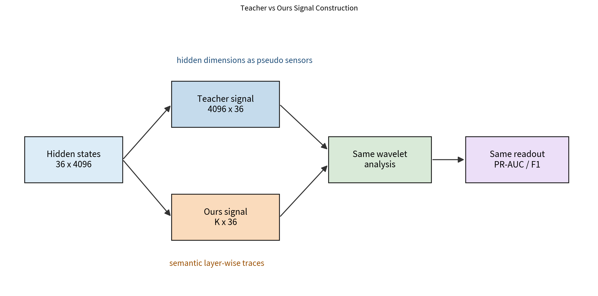
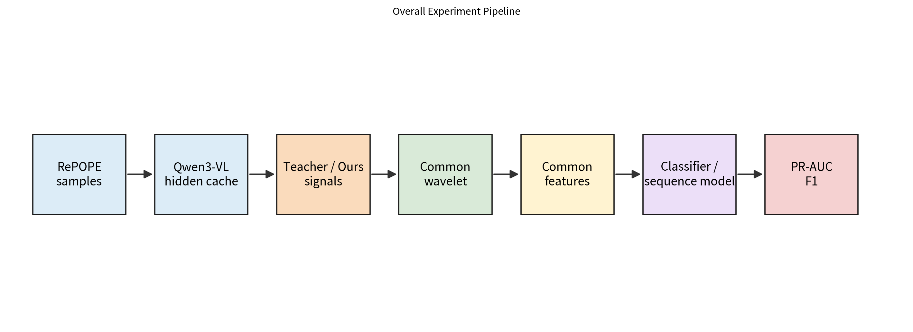
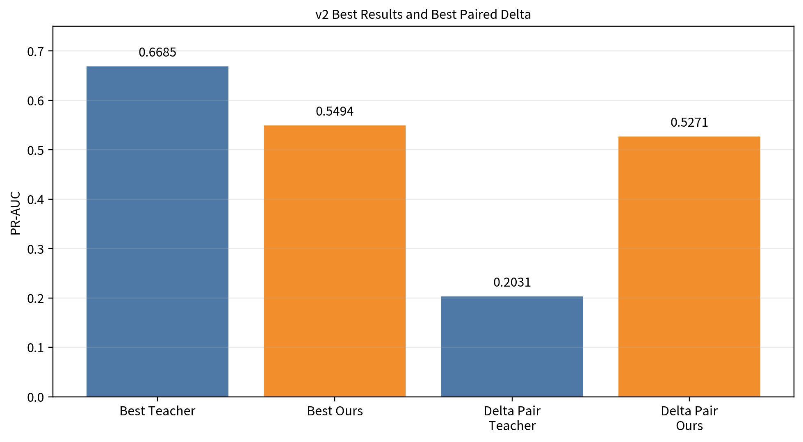
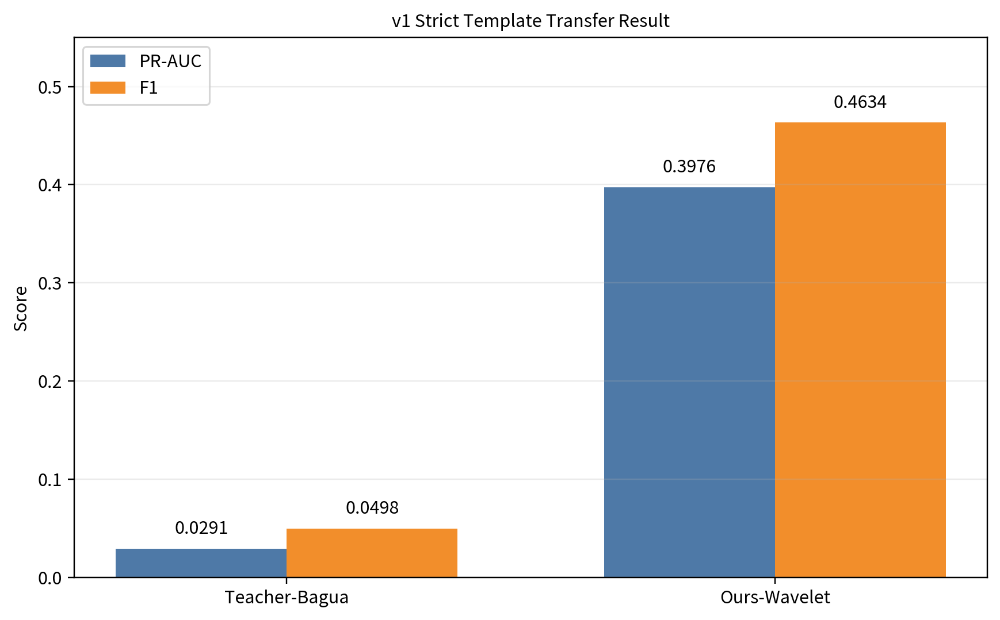
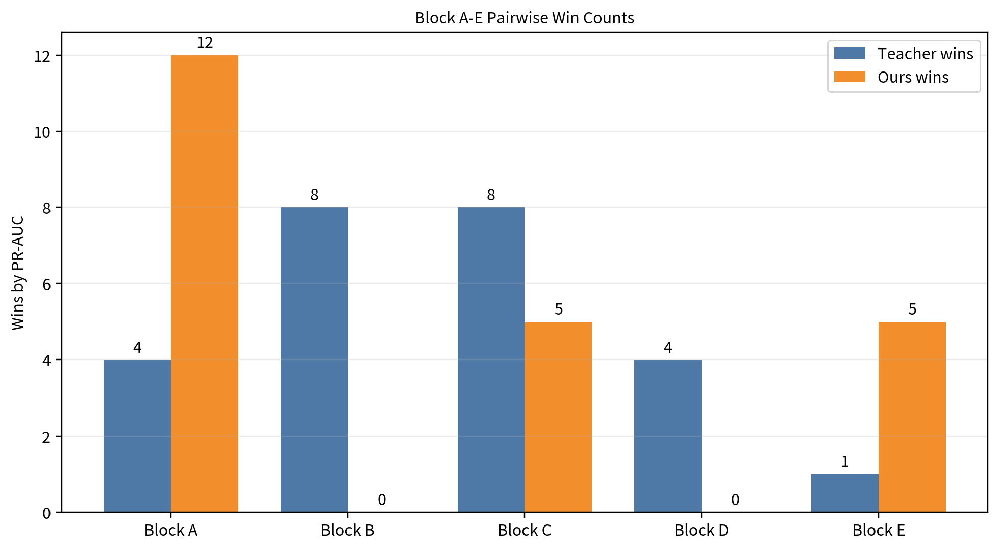
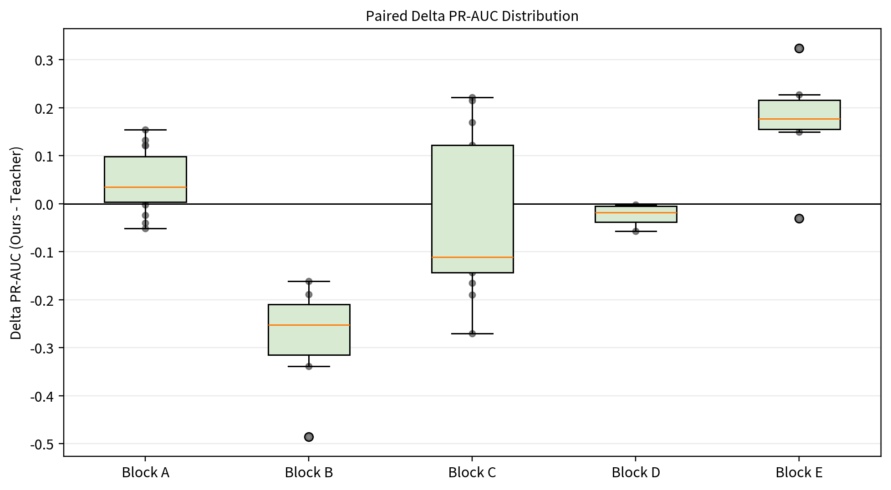
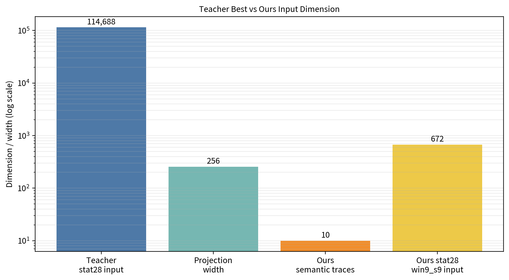

# 基于小波分析的大模型内部状态幻觉检测研究

## 摘要

本实验研究小波分析能否用于大模型内部状态的对象幻觉检测。实验对象是 Qwen3-VL-8B-Instruct 在 RePOPE 数据集上的 36 层 hidden states（隐藏状态），任务是识别 hard object hallucination（硬对象幻觉），即图像中不存在某个对象，但模型回答该对象存在。

实验比较两类方法。Teacher-Bagua 表示传统工业故障诊断模板的直接迁移。它把 hidden states 看成 $4096 \times 36$ 的矩阵，把 4096 个 hidden dimensions（隐藏维度）当作伪传感器通道，把 36 层 transformer layers（Transformer 层）当作伪时间轴。Ours-Wavelet 表示面向大模型内部结构改造的小波方法。它先把每层 4096 维 hidden state 压缩成少量 layer-wise semantic traces（层间语义轨迹），再对这些轨迹做小波分析。

v1 严格模板迁移实验中，Teacher-Bagua 最佳 PR-AUC 只有 0.0291，F1 只有 0.0498；Ours-Wavelet 最佳 PR-AUC 为 0.3976，F1 为 0.4634。v2 成对控制实验进一步显示，两类方法不是简单单边胜负。Teacher 在高容量模型直接利用高维原始 hidden states 时可以达到 PR-AUC 0.6685，而 Ours 在小波摘要和 28 统计特征实验中更稳定。该结果说明，小波分析本身没有失效，失效的是把工业物理信号模板机械套到大模型 hidden states 上。大模型内部状态中的有效小波信号轴，应更适合定义为 transformer 层间语义计算轨迹。

## 关键词

小波分析；大模型内部状态；视觉语言模型；对象幻觉检测；RePOPE；配对实验；PR-AUC

## 1 引言

传统工业故障诊断常用“小波去噪、滑窗统计特征、时序建模”的流程。发动机、轴承和振动传感器的信号有明确物理时间轴。相邻采样点有连续关系，频率、冲击、谐波和基线漂移都有物理含义。

大模型 hidden states 不满足这个前提。一个样本的内部状态是 36 层、每层 4096 维的向量。36 层有明确顺序，因为它们对应模型的计算深度；4096 个 hidden dimensions 只是表征坐标，不是按物理位置排列的传感器。相邻 hidden dimension 之间没有振动信号中的局部连续关系。

本实验的核心问题不是“小波函数选哪一个最好”，而是“小波到底应该作用在什么信号上”。如果直接把 hidden dimensions 当作传感器，方法形式上类似工业故障检测，但信号假设失配。如果先构造层间语义轨迹，再沿 36 层计算深度做小波分析，小波的多尺度思想才有更清楚的解释对象。

## 2 数据集与任务定义

实验使用 RePOPE 数据集，模型为 Qwen3-VL-8B-Instruct，子集包括 popular、random 和 adversarial。实验不重新生成模型输出，而是复用 Stage 0 已经预提取的 full-layer hidden-state cache。

每条样本包含 36 层 hidden states，每层 4096 维，原始形状为 $(36,4096)$。主任务只保留两类样本：负类是模型回答正确，正类是 hard hallucination，即标注为对象不存在，但模型回答对象存在。false negative、parsed none 和 invalid label 不进入主任务。

| model | dataset | subsets | primary population | positives | positive rate | split strategy | metric |
| --- | --- | --- | --- | --- | --- | --- | --- |
| Qwen3-VL-8B-Instruct | RePOPE | popular/random/adversarial | 7986 | 278 | 3.48% | grouped by image_id | PR-AUC |

主指标使用 PR-AUC（Precision-Recall AUC，精确率-召回率曲线下面积）。这是因为 hard hallucination 是少数类，正类比例只有 3.48%。Accuracy（准确率）会被多数负类支配，不能反映模型是否把少数正类排在前面。F1 先在 validation split（验证集）上选阈值，再在 test split（测试集）上评估。

数据划分按 `image_id` 分组进行。这个设置防止同一张图片同时出现在训练集和测试集，从而避免图像级泄漏。

## 3 方法设计

### 3.1 传统工业小波方法的直接迁移：Teacher-Bagua

Teacher-Bagua 是传统工业故障诊断模板的直接迁移。它把每条样本的 hidden states 从 $(36,4096)$ 转置为：

$$
4096 \times 36
$$

其中 4096 个 hidden dimensions 被当作 4096 个伪传感器通道，36 层被当作伪时间轴。随后，小波分析、滑窗、28 个统计特征和 LSTM/GRU/RF/XGBoost 等模型都作用在这个原始高维表示上。

这个设计故意保留传统模板的形式。它检验的问题是：在不重新定义信号轴的情况下，工业故障诊断流程能否直接迁移到大模型内部状态。

### 3.2 面向大模型内部状态的改造方法：Ours-Wavelet

Ours-Wavelet 不把 4096 个 hidden dimensions 当作传感器。它先从 36 层 hidden states 中构造少量 layer-wise semantic traces（层间语义轨迹），再沿 36 层计算深度做小波分析。默认轨迹包括 hidden norm、层间变化幅度、相邻层余弦相似度、与最终层的收敛程度、二阶层间变化、曲率、中后层对齐差异、yes/no margin、yes/no entropy 和 hidden variance。

Ours 的输入形状为：

$$
K \times 36
$$

其中 $K$ 是语义轨迹数量，远小于 4096。这个设计把小波分析放到有顺序、有语义、有解释对象的信号上。层间波动、突变和收敛变化都可以对应模型内部计算过程。

| method | input shape | signal meaning | wavelet axis | advantage | limitation |
| --- | --- | --- | --- | --- | --- |
| Teacher-Bagua | $4096 \times 36$ | hidden dimensions as pseudo sensors | 36 transformer layers as pseudo time | 保留原始高维 hidden-state 信息 | hidden dimension index 没有物理局部连续性 |
| Ours-Wavelet | $K \times 36$ | layer-wise semantic traces | 36 transformer layers as computation depth | 信号轴有语义，维度低，解释更清楚 | 压缩后会丢失部分原始 hidden 信息 |

图 1 说明两类方法的核心差异。Teacher 保留原始高维 hidden dimensions，Ours 先提取语义轨迹。两者之后使用同样的小波和建模流程。

### 3.3 小波函数与小波变换选择

实验覆盖多类小波函数。Haar 适合检测阶跃突变；db 系列适合紧支撑多尺度分解；sym 系列相位偏移更小；coif 系列更适合趋势近似；bior 系列用于检验线性相位；Morlet 和 Mexican Hat 用于连续尺度分析。

| Wavelet | Key Property | Why Used Here |
| --- | --- | --- |
| Haar | 最简单的阶跃型小波，支撑最短。 | 检查幻觉是否表现为某些层附近的突然跳变。 |
| Daubechies (dbN) | 紧支撑正交小波，N 越大越平滑。 | db2 适合短轨迹局部变化；db4/db6 检查更平滑结构和边界效应。 |
| Symlet (symN) | 近似对称，相位偏移小。 | 保留异常发生层位，适合层间轨迹。 |
| Coiflet (coifN) | 小波和尺度函数都有消失矩。 | 检查趋势近似和更平滑的层间变化。 |
| Biorthogonal (bior) | 双正交，线性相位较好。 | 检验相位稳定性和重构稳定性的影响。 |
| Morlet | 连续复小波，适合振荡型信号。 | 分析层间轨迹中的多尺度不稳定。 |
| Mexican Hat | 高斯二阶导数，适合峰值和脉冲。 | 检查幻觉是否对应局部峰值型异常。 |

小波变换包括 DWT（Discrete Wavelet Transform，离散小波变换）、SWT（Stationary Wavelet Transform，平稳小波变换）、WPT（Wavelet Packet Transform，小波包变换）和 CWT（Continuous Wavelet Transform，连续小波变换）。DWT 快，但会下采样，层位置信息会变弱。SWT 不下采样，更适合 36 层这种短轨迹，但分解层数受长度约束。WPT 会继续分解高频，能获得更细的频带结构。CWT 尺度更连续，适合分析局部多尺度波动。

### 3.4 配对实验设计

v2 使用 paired comparison（配对比较）。每个 `pair_id` 下都有 Teacher 和 Ours 两行。两行共享相同的小波函数、小波变换、窗口策略、特征协议、分类器或时序模型、随机种子和数据 split。唯一核心差别是信号定义方式。

这个设计排除了“Teacher 和 Ours 用了不同分类器”这类干扰。它把比较重点放在信号构造本身：Teacher 使用 hidden dimension pseudo-sensor traces，Ours 使用 layer-wise semantic traces。

图 2 展示了完整流程。从 RePOPE 样本到 hidden-state cache，再到两类信号构造、共同小波分析、共同特征协议和统一评价指标。

## 4 实验设置

### 4.1 数据与评价指标

实验样本来自 Stage 0 cache。cache 检查通过，匹配样本数为 8185，进入 primary population 的样本数为 7986。训练、验证和测试 split 的正类数量分别为 192、48 和 38。

评价指标包括 PR-AUC、Average Precision（平均精确率）、ROC-AUC、F1、precision（精确率）、recall（召回率）、balanced accuracy（平衡准确率）、TPR at 1% FPR 和 FPR at 95% TPR。报告主结论以 PR-AUC 为准。

### 4.2 v1：严格模板迁移实验

v1 是初始严格模板迁移实验。Teacher-Bagua 使用 Haar/db2/db4 level 1 小波、window size 4、stride 4、28 个传统统计特征和 LSTM。其输入序列形状为 $(9,4096 \times 28)$，也就是 $(9,114688)$。

Ours-Wavelet 使用 6 条语义轨迹，做 SWT 小波分析，再用 logistic regression（逻辑回归）或 XGBoost。该版本的目的不是完整配对，而是快速检验严格工业模板是否可以直接迁移。

### 4.3 v2：成对控制实验

v2 是成对控制实验。它包含 57 个 pair_id 和 114 行方法结果，其中成功行 94，失败行 20。失败配置保留在结果表中，没有从报告中删除。

| Item | Value |
| --- | --- |
| pair_ids | 57 |
| paired rows | 114 |
| success rows | 94 |
| failure rows | 20 |
| both-success pairs | 47 |
| both-failure pairs | 10 |
| Ours wins | 22 |
| Teacher wins | 25 |
| Ours win rate | 46.8% |
| Teacher win rate | 53.2% |
| full runtime | 8h 5m 47s |

### 4.4 Block A-E 实验设计

v2 按 block 分块设计。每个 block 固定大部分条件，只改变一个主要因素。这样避免完整笛卡尔积带来的规模过大，也能在每个 block 内做清楚的局部控制。

| Block | Question | Main Result | Interpretation |
| --- | --- | --- | --- |
| A | 小波函数与小波变换是否改变结论 | Ours 12/16 胜；最佳为 CWT Morlet Ours，PR-AUC 0.3673。 | 语义层间轨迹更适合小波摘要分析。 |
| B | 不同窗口策略对两类信号的影响 | Teacher 8/8 胜；global + 28 统计特征 + projected LSTM 达到 PR-AUC 0.6685。 | 高维原始 hidden states 含有强判别信息，大容量模型可以利用它。 |
| C | 不同分类器和时序模型的影响 | Teacher 在 raw sequence 时序模型中更强；Ours 在 wavelet summary static pooled 中更强。 | 两类信号适合不同建模路线，不能用单一胜负概括。 |
| D | 小波去噪策略是否稳定有效 | Teacher 4/4 胜；最佳为 no threshold。 | hidden states 的高频变化不能直接视为噪声。 |
| E | 28 个传统统计特征应该作用在哪类信号上 | Ours 5/6 胜；关键配对中 Ours 比 Teacher 提升 0.3241 PR-AUC。 | 28 特征不是无效，而是更适合语义轨迹。 |

## 5 实验结果

### 5.1 总体结果

v2 的总体结果不是单边胜负。在 47 个双方成功的可比较 pair 中，Ours 按 PR-AUC 赢 22 次，Teacher 赢 25 次。Ours 胜率为 46.8%，Teacher 胜率为 53.2%。

| Category | Config | PR-AUC | F1 | Interpretation |
| --- | --- | --- | --- | --- |
| Best Teacher | B_global_window_stat28_sequence_lstm_projected__lstm_projected_lr0p001 | 0.6685 | 0.5714 | 全层 114688 维统计特征加大投影 LSTM，预测性能最高。 |
| Best Ours | E_win9_s9_window_stat28_static_pooled_rf | 0.5494 | 0.3902 | 语义轨迹加 28 统计特征和 RF，在 Ours 中最强。 |
| Best Paired Delta | E_global_window_stat28_static_pooled_rf | Teacher 0.2031; Ours 0.5271; delta +0.3241 | Teacher 0.1961; Ours 0.4815 | 同样的 28 特征作用在语义轨迹上更有意义。 |

图 4 显示，Teacher 的最高 PR-AUC 来自 Block B 的高维统计特征和 projected LSTM。Ours 的最高 PR-AUC 来自 Block E 的语义轨迹、28 统计特征和 RF。最大配对提升来自 `E_global_window_stat28_static_pooled_rf`，Ours 比 Teacher 高 0.3241 PR-AUC。

### 5.2 v1 严格模板迁移结果

| Method | Best Config | PR-AUC | F1 | Main Interpretation |
| --- | --- | --- | --- | --- |
| Teacher-Bagua | teacher_bagua_haar_l1_lstm | 0.0291 | 0.0498 | 严格模板迁移效果接近随机先验，说明方法假设和 hidden states 结构失配。 |
| Ours-Wavelet | ours_db2_swt_l2_logreg | 0.3976 | 0.4634 | 语义层间轨迹上的小波分析明显优于严格模板迁移。 |

v1 结果说明，严格照搬传统工业模板无法稳定检测 hard hallucination。Teacher-Bagua 最佳 PR-AUC 只有 0.0291，低于数据正类比例附近的有效排序水平。这个结果来自方法假设失配：hidden dimension index 不是物理传感器轴，36 层也不是高频采样时间轴，window=4 上的频域统计非常不稳定。

### 5.3 v2 成对实验总体结果

| block | num_pairs | both_success | ours_wins | teacher_wins | ours_winrate | best_source | best_pr_auc |
| --- | --- | --- | --- | --- | --- | --- | --- |
| A | 19 | 16 | 12 | 4 | 75.0% | Ours | 0.3673 |
| B | 12 | 8 | 0 | 8 | 0.0% | Teacher | 0.6685 |
| C | 13 | 13 | 5 | 8 | 38.5% | Teacher | 0.6038 |
| D | 4 | 4 | 0 | 4 | 0.0% | Teacher | 0.3453 |
| E | 9 | 6 | 5 | 1 | 83.3% | Ours | 0.5494 |

图 5 说明，Ours 在 Block A 和 Block E 更强，Teacher 在 Block B、C、D 更强。这个结果区分了两个问题：哪种信号更适合小波特征工程，和哪种表示在高容量模型下预测性能更高。

图 6 中，$\Delta \text{PR-AUC} = \text{Ours} - \text{Teacher}$。正值表示 Ours 更强，负值表示 Teacher 更强。Block A/E 的分布偏正，Block B/D 偏负，说明两类方法的优势取决于实验场景。

### 5.4 Block A：小波函数与小波变换实验

Block A 固定使用小波摘要特征和简单分类器，主要比较不同小波函数和小波变换。这个 block 不让高容量模型掩盖小波特征本身的效果。

结果显示，Ours 在 16 个双方成功 pair 中赢 12 个。最佳 Ours 配置是 `A_cwt_morl_scales_1_16::Ours::logreg`，PR-AUC 为 0.3673；最佳 Teacher 配置是 `A_dwt_haar_l1::Teacher::logreg`，PR-AUC 为 0.3344。

分析结论：当模型容量较低、输入主要是小波摘要特征时，语义层间轨迹更适合小波分析。Morlet CWT 在 Ours 上表现最好，说明层间语义轨迹中存在多尺度波动信息。

### 5.5 Block B：滑窗策略实验

Block B 比较 direct、global、win4、win6、win9、win12 等窗口方式。固定小波配置和 projected LSTM，用来观察窗口策略对两类信号的影响。

结果显示，Teacher 在 8 个双方成功 pair 中全部胜出。最佳配置是 `B_global_window_stat28_sequence_lstm_projected__lstm_projected_lr0p001::Teacher::lstm_projected_lr0p001`，PR-AUC 为 0.6685，F1 为 0.5714。

分析结论：该结果说明原始 hidden states 本身包含强判别信息。Teacher best 使用全 36 层，每个 hidden dimension 提取 28 个统计特征，得到 $4096 \times 28 = 114688$ 维输入，再通过 $114688 \rightarrow 256$ 的大线性投影层输入 LSTM。这个投影层参数量约为：

$$
114688 \times 256 + 256 = 29360384
$$

也就是约 2936 万参数。因此，Teacher best 的高分不是传统工业物理传感器假设成立，而是高维原始 hidden states 加大容量模型带来的预测能力。global window 下 LSTM 序列长度接近 1，它更像一个大容量非线性分类器，而不是真正在建模长时序。

图 7 显示 Teacher best 的输入维度远高于 Ours。这个对比说明，预测性能和方法解释性必须分开看。

### 5.6 Block C：建模方法实验

Block C 比较 Logistic Regression、SVM、RF、ExtraTrees、XGBoost、LSTM、GRU、TCN 和 CNN1D 等模型。静态模型使用小波摘要 pooled 特征，时序模型使用 raw sequence。

结果显示，Teacher 在 13 个双方成功 pair 中赢 8 个，Ours 赢 5 个。Teacher 的最佳配置是 `C_raw_sequence_gru_projected__gru_projected_lr0p0003::Teacher::gru_projected_lr0p0003`，PR-AUC 为 0.6038。Ours 在 wavelet summary static pooled 的 RF、XGBoost、ExtraTrees、LogReg 和 linear SVM 中均优于 Teacher。

分析结论：Teacher 更适合高容量时序模型直接学习原始高维信息。Ours 更适合小波摘要后的静态模型。这个 block 表明，两类信号对应两条不同路线：一种是高维表征直接学习，另一种是语义轨迹小波特征工程。

### 5.7 Block D：小波去噪策略实验

Block D 固定 DWT db2 level 2、global window 和 logistic regression，比较 no threshold、universal soft、universal hard 和 sure soft 等阈值策略。

结果显示，Teacher 在 4 个双方成功 pair 中全部胜出。最佳配置是 `D_dwt_db2_l2_threshold_none::Teacher::logreg`，PR-AUC 为 0.3453。no threshold 反而是最佳阈值设置。

分析结论：小波去噪不能照搬到大模型 hidden states。工业振动信号中的高频常常对应传感器噪声；大模型内部状态中的高频层间变化则可以表示决策方向突然改变、视觉信息衰减、错误答案收敛或 yes/no 决策不稳定。这些高频变化本身就是幻觉检测信号。

### 5.8 Block E：28 个统计特征公平实验

Block E 把传统 28 个统计特征同时作用于 Teacher 和 Ours，并使用相同窗口、相同小波和相同分类器。这个 block 检查 28 个统计特征应该作用在哪类信号上。

结果显示，Ours 在 6 个双方成功 pair 中赢 5 个。最佳 Ours 配置是 `E_win9_s9_window_stat28_static_pooled_rf::Ours::rf`，PR-AUC 为 0.5494，F1 为 0.3902。关键配对 `E_global_window_stat28_static_pooled_rf` 中，Teacher PR-AUC 为 0.2031，Ours PR-AUC 为 0.5271，提升 0.3241。

分析结论：28 个统计特征不是完全无效。它们直接作用在 4096 个 hidden dimensions 上时缺乏物理解释；作用在层间语义轨迹上时，均值、方差、峰值、峭度和能量能对应模型内部计算过程中的稳定性、突变和收敛变化。

## 6 讨论

### 6.1 为什么严格照搬工业模板会失败

v1 Teacher-Bagua 的失败来自信号假设失配。传统工业信号的横轴是物理时间，hidden dimension index 不是物理时间，也不是传感器空间。window=4 的短窗口还会让频域统计更不稳定。这个流程形式上像故障诊断，但核心变量没有物理意义。

### 6.2 为什么 Ours 在小波摘要和统计特征场景下更有效

Ours 的语义轨迹直接描述层间更新强度、方向稳定性、向最终状态收敛的过程和回答不确定性。这些轨迹沿 36 层天然有序。小波能量、细节系数、小波熵、峰值和尺度分布都能对应计算过程中的突变、波动和不稳定。因此，当模型容量较低或特征被摘要时，Ours 的信号定义更有优势。

### 6.3 为什么 Teacher 在高容量时序模型下反而更强

Teacher best 使用 114688 维统计特征和约 2936 万参数的输入投影层。它利用的是原始 hidden states 的高信息量和模型容量，而不是工业传感器解释。该结果说明，高维 hidden states 本身是强表征；大容量模型可以从中学习判别边界。这个结论和“小波应该作用在有语义的信号轴上”并不矛盾。

### 6.4 小波去噪在大模型内部状态上的重新理解

在工业故障检测中，去噪常常意味着去除传感器干扰。在大模型内部状态中，高频层间变化不等于噪声。幻觉形成过程中的突变、不稳定和后层错误收敛都会表现为高频变化。对 hidden states 使用小波分析时，更合适的目标不是机械去噪，而是提取多尺度变化模式。

| Insight | Evidence |
| --- | --- |
| 严格模板迁移失败 | v1 Teacher PR-AUC 0.0291，F1 0.0498。 |
| Ours 更适合小波摘要和 28 特征工程 | Block A Ours 12/16 胜，Block E Ours 5/6 胜。 |
| Teacher 在高容量序列模型下可以更强 | Block B Teacher best PR-AUC 0.6685。 |
| Teacher best 高分来自高维统计特征和大容量模型 | 输入 114688 维，再投影到 256 维，投影层约 2936 万参数。 |
| 小波去噪不能直接照搬 | Block D 最佳阈值为 none，高频变化本身包含判别信号。 |
| 预测性能和方法解释性必须区分 | 高维 Teacher 可以预测更强，但不说明 hidden dimension 是物理传感器。 |

## 7 结论

本实验表明，小波分析本身并没有失效，失效的是将传统工业故障诊断模板机械迁移到大模型 hidden states 上。v1 严格模板迁移实验中，Teacher-Bagua 的 PR-AUC 只有 0.0291，说明把 hidden dimensions 当作传感器、把 transformer layers 当作短时振动信号的做法无法稳定检测幻觉。

v2 成对控制实验进一步显示，当 Teacher 和 Ours 使用相同小波函数、相同窗口策略和相同分类模型时，两类方法并非简单单边胜负。Teacher 在高容量模型直接利用高维原始 hidden states 时表现更强，而 Ours 在小波摘要和 28 统计特征等真正体现小波特征工程价值的设置中更强。

更准确的结论是：大模型内部状态中的有效信号既可以被高容量模型直接学习，也可以被重新设计的语义轨迹小波特征捕捉。关键不在于照搬某个固定流程，而在于根据数据结构重新定义小波分析所作用的有序信号轴。对于工业振动信号，这个轴是物理时间；对于大模型幻觉检测，这个轴更适合定义为 transformer 层间语义计算轨迹。

## 参考说明

本报告使用小波分析中的 DWT、SWT、WPT 和 CWT 作为基本多尺度分析工具。RePOPE / POPE 是对象幻觉检测数据集，本实验使用 Qwen3-VL-8B-Instruct 的 Stage 0 full-layer hidden-state cache。当前归档中保留 HALP-adapted hidden-state probe 参照结果，用于说明直接 hidden-state probing 也是有效路线；它不是本作业的主比较对象。本作业主线是比较小波分析应作用在原始 hidden dimensions 还是层间语义轨迹上。

## 附录 A：代码与数据说明

代码副本位于 `../code/`。其中 `scripts/wavelet_course_run.py` 对应 v1，`scripts/wavelet_course_v2_run.py` 对应 v2。核心模块位于 `../code/src/mind/wavelet_course/`。

数据说明位于 `../data/README_dataset.md`。本归档不复制完整 hidden-state cache，只保存 cache manifest 摘要、dataset manifest 和 population audit。

原始结果表位于 `../results/`。报告引用的核心表格位于 `../assets/tables/`，图像位于 `../assets/figures/`。
